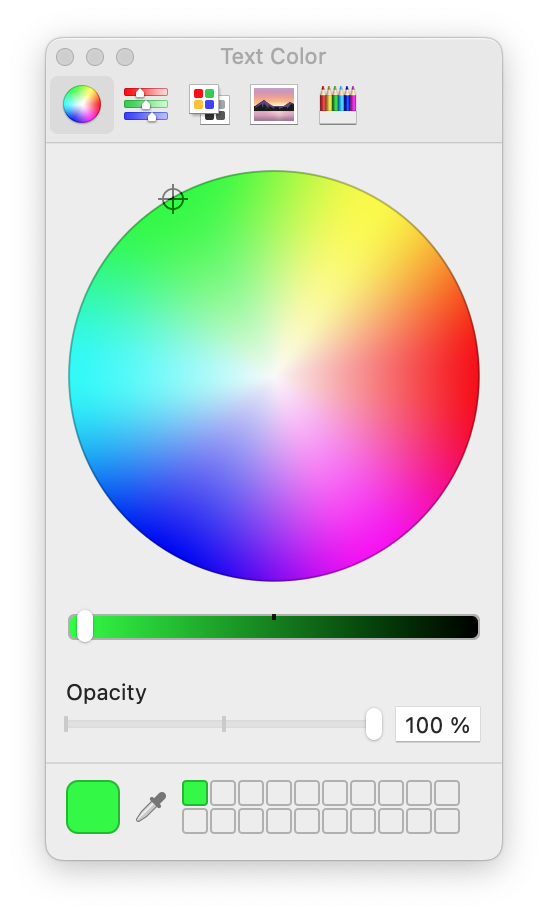

#### July 18, 2022 - A new project is born

electron-playground is itended to be a light-weight sandbox to play and experiment with all sort of things. Mainly to find answers to questions yet to be asked and questions which linger for quiet some time now in the back of my head. Naturally, most stuff will center on Electron. But I will probably also tackle the hotest shit in web technologies in general. And the not so hot but battle-proven libraries and frameworks which might help making a little more sense in this dense jungle we call our profession.

Enough nonsensical chit-chat! I will turn to electron-playground when ODIN/NIDO is too convoluted to try out new things or understand old problems and topics in more depth. Hopefully, this playground is  sufficiently fertile so that nifty little tricks make it back to the main project.

Day 1 - Electron - 101

First steps first: The first step is a more or less verbatim copy of Electron's Quick Start guide. Contrary to NIDO, security is ramped up to the max (at least I think so). **Node integration** is disabled and **context isolation** is engaged. Meaning, we cannot use any Node modules or API in renderer. I think this is a safety measure to prevent injection of code which then has access to the formidable power Node APIs pose. Context isolation takes it up a notch:

> Context Isolation is a feature that ensures that both your preload scripts and Electron's internal logic run in a separate context to the website you load in a webContents. This is important for security purposes as it  helps prevent the website from accessing Electron internals or the powerful APIs your preload script has access to.

Pretty sketchy for my taste. But maybe I will find out in good time. Getting around the restrictions of missing Node integration, **preload scripts** have some ways to close the gap with **context bridge**. From the first glance, through context bridge one can provide some API to renderer which may use selected Node mechanics without exposing all Node features to renderer. Concretely (and in theory), writing a file might be exposed with some specific API (which may also contain additional safety checks) without the need to `require 'fs'` in renderer.

Speaking of security: Web security is turned off in NIDO as well. At least during development mode. Needless to say, that it is recommended to have it enabled at all times. Doing web request from localhost to say WMTS, is really a nightmare, as far as I'm concerned. Who does really understand how this is supposed to work?! Is it possible at all?!

Closing for tonight: node integration, context isolation and web security are all good and well. But what about native LevelDB support in our trusted renderers? From what I understand LevelDB scales down to IndexedDB API/implementation when used in browser environment. I'm pretty sure that I/O performance is really poor compared to native implementation. Also available database memory might be limited to ridiculous low numbers.

These topics are the very first I will try to understand: How much slower is LevelDB in browser flavor? Is native LevelDB possible without compromising security as advocated by the Electron creators. Stay tuned for a new episode, where we add Webpack to the build and can configure native modules to be packaged and used.

#### July 20, 2022 - Webpack and Security

Dear diary! Today I implemented Webpack build. There's nothing new here. Just copied Webpack configuration from NIDO and made a few adjustments. But having Webpack was just an intermediate step. The primary goal was to see how context isolation and missing node integration would impact a more serious setup. To make a long story short: Fuck security!

At least two issues pop up with context isolation enabled and node integration disabled. First: Webpack Development Server (i.e. HMR) does not work => `Uncaught ReferenceError: global is not defined`. Second: Certain dependencies require `require` to be available, which is not without node integration. `levelup` for example is such a module => `Uncaught ReferenceError: require is not defined`. While there where a few pointers concerning the first problem (naturally without fixes), the second issue should be no surprise. From the introduction of `levelup` GitHub page:

> Fast and simple storage. A Node.js wrapper for abstract-leveldown compliant stores, which follow the characteristics of LevelDB.

There you have it! A **Node.js wrapper** will probably have a hard time with node integration turned off. BTW: Enabling node integration with context isolation won't do for `levelup` either. Summing up, there is no way around this for the moment:

```javascript
webPreferences: {
  nodeIntegration: true, // default: false
  contextIsolation: false, // default: true, since 12.0.0
}
```

#### July 20, 2022 - Sassy CSS

Dear diary! Long time no see! Today it's time to look into SCSS. An awful lot of CodePen and CodeSandbox examples are based on SCSS. It is not always easy to transpile this code to CSS in your head on-the-fly. At least my head is a pretty bad transpiler. While it might be beneficial to learn CSS from scratch without any fancy-pancy syntax, at some point it is probably worthwhile to learn something new. SASS and SCSS are around for quite some time now (some odd 15 years) and developers seem to have adopted this technology deep and wide. As a side note: SASS is a bit older than SCSS and uses indentation to structure code. SCSS is more in line with CSS parenthesis usage. Setting up Webpack with SASS is a piece of cake. Throw in a SASS itself, a few loaders and a CSS/SCSS rule and you're done.

```
$ npm install -D node-sass sass-loader css-loader style-loader
```

And somewhere in Webpack configuration:

```json
{
  test: /\.(scss|css)$/,
  use: ['style-loader', 'css-loader', 'sass-loader']
}
```

That's it! Now for the funny part: Learning SCSS syntax and its advantages over plain and boring CSS. More on that some other fine day. Sleep well dear diary!

#### July 21, 2022 - ESLint

ESLint undoubtedly can help prevent errors which are not always obvious to a developers casual eye. For me one of the more frequent mistakes is missing dependencies in React hooks. Might be that I am already relying too much on ESLint to spot these error and report them immediately back to me. This entry just summarizes the steps necessary to setup VSCode and Webpack to complain whenever I mess things up. Let's start with Webpack, because running a Webpack build gives fast feedback if all dependencies are in place and the configuration is in order.

.eslint.rc (from NIDO):

```javascript
module.exports = {
  settings: { react: { version: 'detect' } },
  env: { browser: true, es6: true, node: true, mocha: true },
  extends: ['eslint:recommended', 'plugin:react/recommended', 'standard'],
  globals: { Atomics: 'readonly', SharedArrayBuffer: 'readonly' },
  parser: '@babel/eslint-parser',
  parserOptions: { ecmaFeatures: { jsx: true }, ecmaVersion: 2018, sourceType: 'module' },
  plugins: ['react', 'react-hooks'],
  rules: {
   /* configure rules as desired */
  }
}
```

Required development dependencies for Webpack:

```console
npm install eslint-webpack-plugin --save-dev # NOTE: maintained by community not by webpack
npm install eslint-plugin-react --save-dev
npm install eslint-plugin-react-hooks --save-dev
npm install eslint-config-standard --save-dev
npm install @babel/eslint-parser --save-dev
```

Add Webpack ESLint plugin to Webpack configuration(s):

E.g.: webpack.config.js:

```javascript
const ESLintPlugin = require('eslint-webpack-plugin')

module.exports = {
  // ...
  plugins: [new ESLintPlugin(/* options */)]
}
```

ESLint plugin for Visual Studio Code also requires an ESLint installation, either in local workspace or installed globally. Restarting Visual Studio Code might be required though.

```console
npm install eslint --save-dev
```

And that was it for tonight's installment. ESLint is up and running and thus helping us to focus on the more interesting stuff.

#### July 22, 2022 - Chapter 1 - React Service Context

Some React components need some sort of dependencies, at least the decent ones. Be it to retrieve or store state or to otherwise communicate with different parts of the system. I am reluctant to use the term Dependency Injection in this context, because it is a broader and more general topic. But alas, we want to inject services to components nonetheless. Using global modules imported in the context of a component is only valid in the most simple cases. As soon as services depend on each other (read dependency graph) things get messy and out of hand quite fast. Also considered must be the need to setup services in an asynchronous manner. Say we want to provide some sort of store which needs additional setup, like asynchronously inserting required default values on first start or migrate data between versions.

Contrary to prop drilling, React's own Context API is ideal for the static nature of services which are usually setup once on startup and stay put for the remaining time. Show me the code already!

hooks.js:

```javascript
import React from 'react'

const ServiceContext = React.createContext({})

export const ServiceProvider = props => {
  const { children, ...services } = props

  return (
    <ServiceContext.Provider value={services}>
      {children}
    </ServiceContext.Provider>
  )
}

/**
 * useServices :: () => {k, v}
 * useServices :: [k] => [v]
 * useServices :: k => v
 */
export const useServices = arg => {
  const services = React.useContext(ServiceContext)
  return arg
    ? Array.isArray(arg)
      ? arg.map(key => services[key])
      : services[arg]
    : services
}
```

Here we opt for a single context for all services. `ServiceContext` receives an associative array with all services registered under their respective keys. Context nesting might be also possible, but it is not practical for more than two or three levels. `ServiceProvider` is used to somewhere way up in the component hierarchy for child components to be useful. But instead of using `ServiceProvider` directly, it is wrapped by `ServiceContext` component which deals with the asynchronous process to setup the services.

ServiceContext.js

```javascript
import React from 'react'
import { ServiceProvider } from './hooks'

export const ServiceContext = ({ children, provider }) => {
  const [services, setServices] = React.useState(null)
  React.useEffect(() => { provider().then(setServices) }, [provider])

  return services && (
    <ServiceProvider { ...services }>
      {children}
    </ServiceProvider>
  )
}
```

`ServiceContext` accepts an asynchronous provider function which actually creates the services. Only when this promise is resolved this part of the component hierarchy is rendered.

index.js:

```javascript
import React from 'react'
import { createRoot } from 'react-dom/client'
import { ServiceContext } from './components/ServiceContext'
import { App } from './components/App'

const services = async () => ({
  versions: process.versions
})

const container = document.createElement('div')
document.body.appendChild(container)
const root = createRoot(container)
root.render(
  <ServiceContext provider={services}>
    <App/>
  </ServiceContext>
)
```

In this example `ServiceContext` is actually the first node in the hierarchy. Finally for the actual application through `useServices()` hook.

App.js:

```javascript
import React from 'react'
import * as Hooks from './hooks'
import './App.scss'

export const App = () => {
  const versions = Hooks.useServices('versions')

  return (
    <>
      <h1>Hello World!</h1>
      We are using Node.js <span>{versions.node}</span>,
      Chromium <span>{versions.chrome}</span>,
      and Electron <span>{versions.electron}</span>.
    </>
  )
}
```

There you have it! Clean and simple (I think). This pattern proved valuable in NIDO for quite some time now. It is easy enough to understand and scales well will increasing demands on service setup and inter-service dependencies. What's more, it probably simplifies component testing dramatically. But that's a topic I might look into in some unknown future.

#### July 22, 2022 - Chapter 2 - Two-way Binding

Hello again! Following is a quick writeup of a simple two-way binding of a database value and a React component state. Meet `useMemento()` hook.

```javascript
export const App = () => {
  const [scope, setScope] = Hooks.useMemento('ui.sidebar.scope')
	...
}
```

This sure looks similar to React.useState() and also feels quite like it. The difference is for once, the value behind key `ui.sidebar.scope` is retrieved and written from and to the database and that whenever the value changes, the state `scope` is updated accordingly. Even if some other part of the application triggered the update. Another subtle difference is that the value is only available **after** the first render cycle (or event somewhat later). This is because value is fetched asynchronously and takes at least two ticks to be available (including the read request.) I guess that it is not hard to imagine how to make good use of our new friend. It's time to have a peak under the hood.

hooks.js:

```javascript
export const useMemento = key => {
  const { store } = useServices()
  const [value, setValue] = React.useState(null)
  const put = React.useCallback(value => { store.put(key, value) }, [store, key])

  React.useEffect(() => {
    // Get initial value; expect key to be present.
    (async () => setValue(await store.get(key)))()
    const handler = (k, v) => k === key && setValue(v)
    store.on('put', handler)
    return () => store.off('put', handler)
  }, [store, key])

  return [value, put]
}
```

Not overly complicated, right? Nevertheless, there is an important detail which should be understood: The `useCallback()` on `put` operation. Imagine for a moment that `put` would be as simple as `value => store.put(key, value)`. In this case, every value change would also change the reference to `put` in the hooks result to a new function instance. On the callers site this would invalidate hooks directly and indirectly depending on this function (`setScope` in the example above.) At a later point we will have a closer look at  `useMemento`s four line effect code. This code is pretty straight forward and not hard to understand, but I don't like it too much.

Ah, sorry! I almost forgot that the service context (remember?) had to learn a few new tricks for `useMemento()` to work:

index.js:

```javascript
import levelup from 'levelup'
import memdown from 'memdown'
import encode from 'encoding-down'
import uuid from 'uuid-random'

const services = async () => {
  const versions = process.versions
  const scopes = ['layer', 'feature', 'link', 'symbol', 'marker']
  const randomScope = () => scopes[Math.floor(Math.random() * scopes.length)]
  const store = levelup(encode(memdown(), { valueEncoding: 'json' }))

  await store.batch([
    { type: 'put', key: 'ui.sidebar.showing', value: true },
    { type: 'put', key: 'ui.sidebar.scope', value: scopes[0] },
    { type: 'put', key: 'ui.sidebar.filter', value: uuid() }
  ])

  return {
    versions,
    store,
    scopes,
    randomScope
  }
}
```

#### September 29, 2022 - Color Picker

Color picker, you say? What's the problem? There is a ton of components available to choose from. Just pick one and you're done! Well, no! Let's gather the requirements and see what we want to deliver.

First we want to have an **input control** which serves as an anchor to open a color swatches popup or other means to choose a color. This control must display the current color in an easily recognizable way. The control should not take up too much horizontal space, because it will be combined with at least two additional controls in a single and rather narrow row. It must be possible to also display some sort of null value which means no color is selected. macOS Preview for example indicates null values by a red diagonal line on white background:  macOS Pages uses a button group with two buttons. The left button opens a color swatches popup and the right button opens the native macOS color dialog:  Microsoft Excel also consists of a button group, but here the left button applies the current color to the selected element and the right button opens a swatches popup: 

In general it should be possible to directly select a color from a set of predefined colors. Ideally, recently used colors are available as well. macOS native color dialog for example has room for 20 user defined colors:
 
